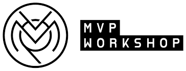

# MVPW 3327 Bootcamp Tasks

##

This repo represents my solutions for the [MVP Workshop's](https://mvpworkshop.co/) 3327 Bootcamp.

The bootcamp consists of 4 tasks, with an objective to write and test a Donation Platform that rewards the first time donators with an ERC-721 token.

## Tasks

- **Task 1** : Write a Solidity Smart Contract (SC) where owner can create campaigns to which donators can donate. [Use Remix IDE]
- **Task 2** : First time donators receive an ERC-721 token. [Using Hardhat with Javascript]
- **Task 3** : Test everything using Hardhat [with Typescript].
- **Task 4** : Test everything using Brownie.

## Repo organization

Each task has its unique subfolder. More detailed information is present in the README.md of each task.

## Additional Links

### IDEs

- [Remix IDE](https://remix.ethereum.org/)

### Standards

- [ERC-721](https://eips.ethereum.org/EIPS/eip-721)

### Testing Frameworks

- [Hardhat](https://hardhat.org/)
- [Brownie](https://eth-brownie.readthedocs.io/en/stable/)
